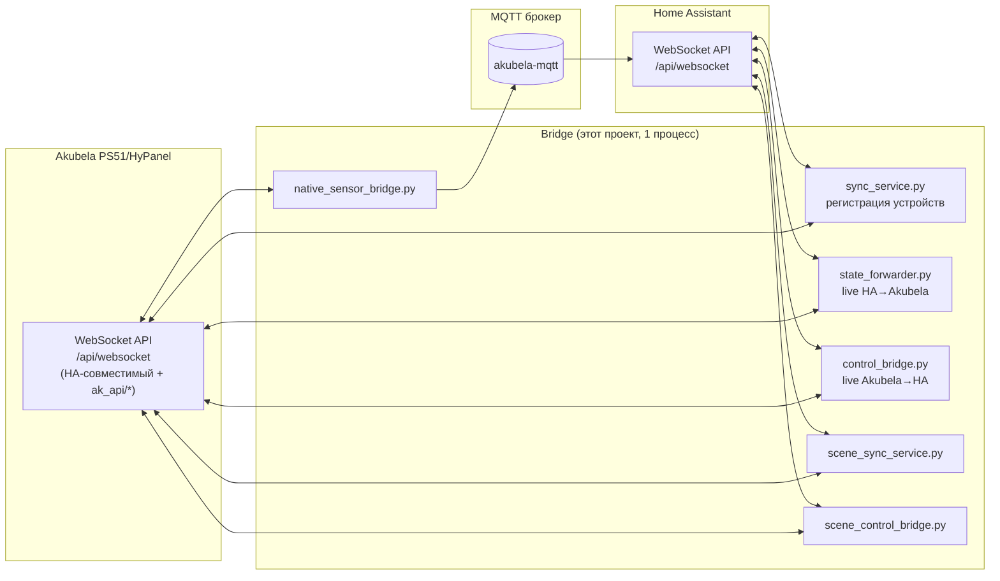

# Архитектура моста Akubela ↔ Home Assistant

Этот документ — техническое описание того, как устроен и почему именно
так устроен бридж между Home Assistant и панелью Akubela PS51/HyPanel.
Рассчитан на инженерную аудиторию, которая будет разбираться в коде,
поддерживать или расширять систему.

## 1. Постановка задачи

Панель Akubela PS51 — самостоятельный контроллер умного дома с
собственным UI, своими устройствами (Zigbee/проводные) и своим
локальным API. Home Assistant — отдельная система с собственным
реестром сущностей. Между ними нет штатной интеграции.

Цель бриджа:
1. Устройства и сцены, настроенные в HA, должны управляться и с панели
   Akubela — без ручного дублирования настроек.
2. Управление с панели должно долетать до HA и наоборот, с минимальной
   задержкой (доли секунды — секунды), без опроса (polling).
3. Родные датчики самой панели должны быть видны в HA.
4. Система должна работать как один процесс, переживать разрывы связи,
   не плодить дублей при перезапуске и не создавать паразитных
   бесконечных обменов между двумя системами.

## 2. Ключевая находка о протоколе

Панель Akubela внутри себя поднимает **встроенный WebSocket-сервер,
протокольно совместимый с Home Assistant** (`ha_version: 4.0.1` в
хендшейке). Это не наша реализация — это то, как устроена сама панель,
и подтверждено двумя независимыми источниками:

1. Сниффинг реального трафика веб-морды панели (`SEND`/`RECV` дамп).
2. Независимый проект [jaaneo/akubela-homeassistant](https://github.com/jaaneo/akubela-homeassistant)
   (MIT-лицензия) — HA-интеграция, которая подключается к панели именно
   так и использует именно этот протокол для управления её устройствами.

Практическое следствие: **мы используем один и тот же клиентский код**
(`ws_base.py`) для соединения и с настоящим HA, и с панелью — это не
два разных протокола, а один и тот же, надетый на два разных сервера.

Handshake:
```
← {"type":"auth_required","ha_version":"4.0.1"}
→ {"type":"auth","access_token":"..."}
← {"type":"auth_ok"}
```

Дальше — обычные команды HA WS API (`get_states`, `subscribe_events`,
`call_service`) **плюс** специфичные для Akubela команды с префиксом
`ak_api/*` (`device/add`, `device/get`, `device/del`, `scene/add`,
`scene/get`, `scene/del`, `config/set`, `id_ext/next`) — это уже
собственное расширение протокола панелью, не входящее в стандартный
HA API.

Токен панели — **не токен HA**, а собственный токен сессии панели,
который в браузере лежит в `localStorage.AKUBELA_USER-TOKEN` (в виде
JSON `{"value":..., "time":..., "expire":...}`).

## 3. Общая схема



Всё работает в одном asyncio-процессе (`main.py`), с двумя постоянными
WebSocket-соединениями (к HA и к панели) и несколькими независимыми
корутинами, слушающими события с обеих сторон параллельно
(`asyncio.gather`).

## 4. Транспортный слой (`ws_base.py`)

Общий клиент для обоих WS-соединений. Ключевые решения:

**Один читающий таск на соединение.** Изначально в проекте было два
независимых потребителя одного сокета (запрос-ответ и поток событий) —
это гонка: сообщение могло достаться не тому, кто его ждал. Сейчас
один `_reader_loop()` разбирает всё и раздаёт:
- ответы на команды — через `asyncio.Future`, по `id`;
- события — через **pub/sub с fan-out**: каждый вызов `events()`
  создаёт свою очередь и получает **копию** каждого события. Это
  важно: если несколько частей бриджа слушают один и тот же
  event-поток (например живой форвардер и отладочный логгер), общая
  `asyncio.Queue` отдала бы каждое сообщение только одному из них —
  раньше это было реальным багом, обнаруженным при тестировании.

**Автопереподключение** с экспоненциальным backoff, повторная
подписка на события через `on_reconnected()`.

## 5. Направление HA → Akubela: регистрация устройств

`sync_service.py`, запускается разово и потом раз в
`RESYNC_INTERVAL_SEC` (по умолчанию 5 минут):

1. `ha.get_states()` — снимок всех сущностей HA.
2. Для каждой сущности `device_registry.build_device_spec(domain, entity)`
   решает, нужно ли её пушить и с каким `device_type`/`feature`/
   `device_config` (см. таблицу в `DEVICE_GUIDE.md`).
3. `device_id_ext` — **детерминированный** (md5-хэш `entity_id`,
   не случайный) — это делает регистрацию идемпотентной: при
   повторном запуске бридж не плодит дубли, а узнаёт "своё" устройство
   по `device/get`.
4. Если устройство уже есть и конфигурация не поменялась — пропускаем.
   Если поменялась (например поменяли feature) — удаляем и
   пересоздаём.
5. После регистрации — `_push_initial_states()`: сразу выставляет
   текущее состояние на панели, не дожидаясь следующего изменения в HA.
6. `_prune_out_of_scope()` — удаляет с панели устройства, которые мы
   раньше зарегистрировали, но сущность вышла из `PUSH_DOMAINS`,
   попала в `EXCLUDE_ENTITIES`, или (важно) сама пришла из Akubela
   через `native_sensor_bridge.py`/ручной MQTT — иначе получится
   зеркальный дубль сама-в-себя.

Соответствие entity_id ↔ device_id_ext ↔ device_id ↔ ak_domain
хранится персистентно в `bridge_state.json` (класс `StateStore`).

## 6. Живая синхронизация состояний

Регистрация (раздел 5) создаёт устройство один раз, но не следит за
текущим состоянием непрерывно — для этого два отдельных потока,
работающих параллельно и независимо:

**`state_forwarder.py` (HA → Akubela).** Подписан на `state_changed` в
HA. Для каждой зарегистрированной сущности пересылает на панель:
- режим/состояние (on/off, hvac_mode, open/closed, locked/unlocked) —
  через `device_registry.resolve_state_service()`, единая точка выбора
  правильного имени сервиса под домен (см. раздел 8);
- для `climate` — целевую и текущую температуру;
- для `light` — яркость и цветовую температуру;
- для `cover` — позицию.

**`control_bridge.py` (Akubela → HA).** Симметрично, но в обратную
сторону: подписан на `state_changed` **на WS-канале панели** (не HTTP!
см. раздел 7) и транслирует изменения в HA через `call_service`.

Оба используют `ak_domain`, сохранённый в `StateStore` при регистрации
— он может отличаться от исходного HA-домена (например
`input_boolean.klapan` в HA становится `switch.<id>` на панели), и
использование не той стороны привело бы к вызову несуществующего
сервиса.

## 7. Почему не HTTP callback

Изначально направление Akubela → HA планировалось через HTTP: при
`device/add` панели передаётся `url`, куда она теоретически должна
слать запросы при управлении устройством. На практике:
- формат этих запросов не удалось поймать вживую (никто физически не
  нажимал кнопку во время сниффинга трафика);
- панель и так транслирует `state_changed` по WebSocket для **любых**
  своих сущностей, включая наши виртуальные — это было эмпирически
  подтверждено (`test_events.py` видел изменение состояния виртуального
  устройства "Klapan") и независимо подтверждено кодом jaaneo, который
  управляет устройствами панели именно так.

Поэтому основной канал Akubela → HA — WebSocket `state_changed`, а
`control_server.py` (HTTP) остался как резервный/отладочный маршрут, не
подключённый к основной логике.

## 8. Разные домены — разные сервисы

HA и Akubela используют HA-style `call_service(domain, service, entity_id, ...)`,
но конкретное имя сервиса зависит от домена:

| Домен | Сервисы | Подтверждено |
|---|---|---|
| `light`, `switch` | `turn_on` / `turn_off` | вживую |
| `climate` | `set_hvac_mode(hvac_mode=...)`, `set_temperature(temperature=...)` | вживую (mode), по аналогии (temperature) |
| `cover` | `open_cover` / `close_cover` / `stop_cover` / `set_cover_position(position=...)` | кодом jaaneo |
| `lock` | `lock` / `unlock` | по аналогии, не откалибровано |

Единая точка выбора — `device_registry.resolve_state_service(domain, state)`,
используется и в `state_forwarder.py`, и в `control_bridge.py`, чтобы
не дублировать логику и не рассинхронизировать поведение двух
направлений (раньше было отдельно в двух местах, что и приводило к
рассинхрону).

## 9. Защита от эхо-петель

Двусторонняя live-синхронизация создаёт риск: HA меняет состояние →
пушим в Akubela → Akubela эмитит `state_changed` → пушим обратно в HA
→ ... Источник петли — либо конверсия с потерей точности (например
kelvin↔mired), либо сторонняя логика (автоматизация на панели,
реагирующая на любое изменение состояния переключением).

Три уровня защиты:

1. **Дедуп по значению** — каждый форвардер помнит последнее
   отправленное *им самим* значение и не шлёт повтор, если оно не
   изменилось.
2. **Rate-limit по времени** для яркости/цвета света
   (`LIGHT_FORWARD_MIN_INTERVAL_SEC`, по умолчанию 1.5с) — защищает от
   быстрого дрожания значений с потерей точности при конвертации.
3. **`loop_guard.py` — детектор дребезга.** Считает переключения одной
   сущности в скользящем окне (по умолчанию 6 за 3 секунды). Человек
   физически не жмёт кнопку так часто — если порог превышен, это
   эхо-петля или чужая автоматизация. Пересылка для этой сущности
   приостанавливается на `suspend_sec` (по умолчанию 60с) с явным
   `ERROR` в логе, вместо бесконечного шторма запросов.

## 10. Родные устройства панели → HA (`native_*_bridge.py`)

Физические устройства, подключённые к самой панели (а не заведённые
нами как виртуальные устройства через `device/add`) — датчики, реле,
замок/домофон, камера — не участвуют в направлении Akubela → HA через
`control_bridge.py` — тот работает только с сущностями,
зарегистрированными нами (есть в `StateStore`).

Для родных устройств — отдельное семейство модулей, у каждого своя
ответственность, но общий каркас: слушаем `get_states()` +
`state_changed` на панели, отличаем "не наше" от "нашего" по признаку
`device_id` не в `StateStore` (см. `is_own_mqtt_bridge_entity()` в
`device_registry.py`), и публикуем в HA через **MQTT Discovery**
(`homeassistant/<platform>/<id>/config` + `.../state`) — HA сам создаёт
сущности, без правки `configuration.yaml`.

- **`native_sensor_bridge.py`** — только чтение (датчики температуры,
  влажности, освещённости, движения и т.п. — домены `sensor`/
  `binary_sensor`, настраиваются через `NATIVE_SENSOR_DOMAINS`).
- **`native_switch_bridge.py`** — двусторонне (родные реле/
  переключатели, например Modbus RTU реле). Управление обратно в
  Akubela идёт через `call_service("switch","turn_on"/"turn_off",...)`
  — тот же подтверждённый паттерн, что и для наших собственных
  виртуальных Switch-устройств, риска в команде нет. Отфильтровывает
  каналы без реального состояния (`None`/`""`/`"unknown"`/`"unavailable"`)
  — на практике встречались незадействованные/неоконфигурированные
  слоты того же модуля реле, публиковать которые в HA бессмысленно (см.
  раздел 18).
- **`native_lock_bridge.py`** — двусторонне (замок/домофон). Если
  устройство репортит персистентное состояние (`locked`/`unlocked`) —
  публикуется как HA `lock` с подтверждённым `call_service("lock",
  "lock"/"unlock",...)`. Если состояния нет (по официальному документу
  Akubela ability `doorphone` без state, только разовое действие) —
  публикуется как HA `button` с непроверенным вызовом (см.
  `test_doorphone_unlock.py`). На реальном устройстве (домофон X915S)
  оказалось, что оно репортит домен `lock` с настоящим состоянием —
  то есть попал в подтверждённую ветку, а не в экспериментальную.
- **`native_camera_bridge.py`** — попытка получить снимок с камеры по
  HTTP через `entity_picture`/`api/camera_proxy` (тот же путь, что
  использовал бы настоящий HA). **Подтверждённо не работает**: панель
  отвечает `500 Internal Server Error` с трейсбеком её собственного
  `aiohttp`-сервера — баг на стороне прошивки, не на нашей. Выключено
  по умолчанию (`NATIVE_CAMERA_ENABLED=false`), включается флагом
  только для повторной проверки на будущих прошивках.

Три моста (`sensor`/`switch`/`lock`) дополнительно делают периодическую
пересинхронизацию раз в `RESYNC_INTERVAL_SEC` — чтобы устройство,
добавленное в Akubela уже после старта бриджа, появилось в HA без
перезапуска процесса.

## 11. Сцены

Симметрично устройствам, но отдельным набором модулей
(`scene_registry.py`, `scene_sync_service.py`, `scene_control_bridge.py`)
и отдельным файлом состояния (`bridge_scene_state.json`) — сцены и
устройства не должны путать друг друга в одной таблице.

Направление HA → Akubela (регистрация сцены как кнопки на панели) —
рабочее, схема `ak_api/scene/add` подтверждена вживую.

Направление Akubela → HA (нажатие сцены на панели запускает сцену в
HA) — **экспериментальное**: подтверждено только то, что сцены имеют
`entity_id` вида `scene.<id>` (косвенно, через код jaaneo, который
активирует сцену панели именно так из HA). Само событие нажатия сцены
на панели не поймано вживую — `scene_control_bridge.py` логирует
сырые `[RAW]` события для последующей калибровки.

## 12. Идемпотентность и самовосстановление

- Устройства и сцены идентифицируются детерминированным хэшем
  `entity_id`, а не случайным ID — перезапуск бриджа не создаёт дублей.
- `_prune_out_of_scope()` удаляет устройства/сцены, переставшие быть
  нужными (изменился `PUSH_DOMAINS`, добавили в `EXCLUDE_ENTITIES`, и
  т.п.) — конфигурация в `.env` является source of truth, а не история
  ручных действий.
- При потере соединения — автопереподключение с backoff и повторной
  подпиской, без перезапуска процесса.

## 13. Калибровка виджетов панели (light и cover)

`device_type` определяет категорию устройства, но конкретный виджет
(какие элементы управления видны) зависит от `feature` — а
соответствие "номер feature → набор элементов управления" **нигде не
задокументировано** и не следует из `device_config`. Единственный
надёжный способ — создать пробные устройства с разными `feature` и
посмотреть глазами (`probe_light_features.py`, `probe_cover_features.py`).

Так откалибровано:

**Light** (`device_registry.py: LIGHT_FEATURE_*`):
- `0` — просто on/off
- `1` — диммер (яркость)
- `4` — диммер + цветовая температура (используется по умолчанию)
- `2` — только цветовая температура, без яркости
- `3, 5, 6` — не откалиброваны для RGB, намеренно не используются

Параметр яркости — отдельная ловушка: HA/код jaaneo используют
`brightness` (0-255), но для нашего виджета (`feature=4`) панель этот
параметр **тихо игнорирует** (`call_service` возвращает `success:true`,
но значение не меняется — подтверждено через `test_brightness_debug.py`,
который сверяет реальное состояние через `get_states()` сразу после
команды). Панель ожидает `brightness_pct` (0-100) — так, как показано в
официальном REST-примере документации Akubela, а не HA-стиль. `color_temp`
при этом передаётся в mired, как у jaaneo — тут расхождения нет.

**Cover** (`device_registry.py: build_device_spec`, домен `cover`):
- `0, 2` — три кнопки открыть/пауза/закрыть, **без слежения за
  положением** — панель не знает, когда открытие/закрытие завершилось,
  из-за чего команда `open_cover` иногда не доводила виджет до
  финального состояния `open` (закрытие работало стабильнее, видимо
  потому что 0 — естественная конечная точка)
- `1, 4, 7` — слайдер с реальной позицией (используется `1`)
- `3, 5, 9` — открытие/закрытие "по ширине", кнопочный режим
- `6, 8` — угол наклона ламелей (для жалюзи, не для штор)

Поскольку у виртуальной шторы нет мотора с концевиком, `open_cover`/
`close_cover` сами по себе не гарантируют, что панель зафиксирует
финальное состояние — `state_forwarder.py` досылает явное
`set_cover_position(100 или 0)` сразу вслед за командой режима, как
подтверждение конечной точки.

## 14. Ограничение: категория `Sensor` нельзя создать через `device/add`

Экспериментально подтверждено (`probe_air_quality.py`): **ни один**
`device_type` категории `Sensor` не создаётся через `ak_api/device/add`,
включая уже используемые в коде (`"Gas Sensor"` и другие) — панель
отвечает `success:true`, но устройство не появляется в `device/get`.
Это не вопрос неправильного названия `device_type` — контрольный тест с
заведомо рабочим значением тоже не создал устройство.

**Следствие**: направление HA → Akubela для домена `sensor` не работает
и не может быть исправлено выбором другого `device_type` — это,
похоже, ограничение самого протокола (виртуальные датчики через этот
API создать нельзя, только физические категории вроде `Light`,
`Switch`, `Cover`, `Floor Heat`). `sensor` стоит держать вне
`PUSH_DOMAINS`, иначе `sync_service` будет каждый раз честно, но
безрезультатно пытаться его запушить.

Направление Akubela → HA для родных (физических) датчиков панели
работает — но не через `device/add`, а через `native_sensor_bridge.py`
(MQTT Discovery), см. раздел 10.

## 15. Совместимость с веб-интерфейсом Akubela

Устройства, созданные через WS API, можно потом открыть и
отредактировать в веб-морде панели (`https://<IP>/menu/apicontrol` →
Устройства) — например вручную поменять `feature`, если автовыбор кода
не подошёл. Это вскрыло два несоответствия между WS API и веб-формой:

- **Длина имени.** Веб-форма выдаёт "Имя слишком длинное" для имён
  длиннее ~32 символов (HA сам склеивает "Имя устройства" + "Имя
  сущности" во `friendly_name`, что легко превышает лимит). `sync_service.py`
  обрезает имя до 32 символов при создании.
- **Формат `device_id_ext`.** Веб-форма выдаёт "Ошибка формата ID
  устройства" для нашего самодельного формата `"ha<хэш>"` — WS API его
  прекрасно принимает, но панель, похоже, ожидает свой собственный
  формат ID (в старых дампах трафика — короткие числовые вроде
  `"00001"`). Есть отдельный метод `ak_api/id_ext/next`, который должен
  выдавать "правильный" ID — `sync_service.py` пробует его первым,
  но на момент написания он возвращал пустой ответ на тестовой
  прошивке (см. `test_id_ext.py`); в этом случае код автоматически
  откатывается на свой хэш. Устройства, созданные так, работают через
  WS API нормально, но при попытке отредактировать их через веб-форму
  может потребоваться сначала поправить ID вручную.

**Устройство, уже созданное на панели, `sync_service.py` больше не
трогает автоматически** — раньше (при рассинхроне `device_type`/
`feature` между кодом и панелью) бридж удалял и пересоздавал
устройство, что заодно откатывало любую ручную правку через веб-морду.
Теперь панель — источник правды для уже существующих устройств; при
следующей синхронизации бридж просто запоминает, что там реально стоит.
Чтобы намеренно вернуть дефолт кода — `force_resync.py <entity_id>`
удаляет устройство и его запись в `bridge_state.json`, оно пересоздастся
заново при следующем `full_sync`.

## 16. Защита от эхо-петель и потери значений (rate-limit → debounce)

Rate-limit (`LIGHT_FORWARD_MIN_INTERVAL_SEC`, по умолчанию 1.5с) применяется
к трём "непрерывным" величинам в обе стороны: яркость/цвет света, позиция
`cover`, целевая температура `climate`.

**Первая версия ронялa значения.** Простой rate-limit ("если пришло
раньше, чем через 1.5с после прошлой отправки - игнорируем") оказался
багом: если человек быстро подвинул слайдер и отпустил, финальное
значение могло попасть в "запретное окно" и **потеряться насовсем** -
приходилось вводить то же значение повторно, чтобы оно "попало" в
свободное окно. Обнаружено на всех трёх величинах (свет, шторы,
термостат) независимо.

**Исправлено через `rate_limited_sender.py: RateLimitedSender`** -
честный debounce вместо grubbing-дропа: если отправить нельзя прямо
сейчас, значение запоминается, и ровно один отложенный досыл
планируется на момент истечения окна - с **актуальным** на тот момент
значением (не с тем, что было при первой попытке). Если за время
ожидания пришло ещё несколько обновлений - они просто обновляют
"ожидающее" значение, лишних досылов не плодится. Гарантия: финальное
состояние всегда долетает, самое большее с задержкой в один цикл
rate-limit, но никогда не теряется. Используется одинаково в
`state_forwarder.py` и `control_bridge.py` для light/cover/climate.

`loop_guard.py` (счётчик переключений в скользящем окне, временная
приостановка при дребезге) остаётся отдельным механизмом для
дискретных состояний (on/off, hvac_mode, open/closed) - там задача
другая: не потеря значения, а остановка бесконечного зацикливания.

**Важно при эксплуатации:** не запускайте несколько экземпляров
`main.py`/`test_roundtrip.py` одновременно - у каждого процесса своя
отдельная память для rate-limit и `LoopGuard`, они не согласованы
между собой и могут взаимно усиливать колебания вместо того чтобы их
гасить.

## 17. Известные ограничения и что дальше

- **Формат активации сцены с панели** не подтверждён (раздел 11).
- **`current_temperature` Akubela → HA** не реализовано — у HA нет
  универсального сервиса для записи read-only атрибута.
- **`lock`: `feature`** не откалиброван (не встречается в дампе
  трафика), используется `0` по умолчанию без проверки.
- **RGB/RGBW-лампы** намеренно регистрируются как простой on/off —
  `feature` для RGB не откалиброван.
- **`ak_api/id_ext/next`** возвращает пусто на тестовой прошивке —
  причина не выяснена, работает автоматический откат на хэш (раздел 15).
- **Исправлено: родные `switch`/`lock` дублировали сами себя.**
  `is_own_mqtt_bridge_entity()` изначально проверяла только домены
  `sensor`/`binary_sensor` (единственное, что умел `native_sensor_bridge.py`
  на момент её написания). После добавления `native_switch_bridge.py` и
  `native_lock_bridge.py` для родных устройств (8-канальное Modbus-реле,
  домофон) эта проверка не была расширена — в результате родное реле,
  опубликованное в HA через MQTT, тут же пушилось `sync_service.py`
  обратно в Akubela как НОВОЕ отдельное виртуальное устройство,
  бесконечно размножая виджеты "Akubela HyPanel (родные устройства)" на
  панели. Исправлено: эвристика расширена на любой домен с именем,
  начинающимся на слаг имени устройства
  (`akubela_hypanel_rodnye_ustroistva...`), который HA сам генерирует при
  группировке сущностей под одним MQTT `device`. При первом
  `full_sync` после исправления уже созданные дубли удалятся
  автоматически через `_prune_out_of_scope()` — но только **со стороны
  Akubela**.
- **Побочный урок: "осиротевшие" retained MQTT-сущности в HA не чинятся
  автоматически.** После фикса выше в HA остались 7 пустых сущностей-
  призраков — их источник (device_id на Akubela) уже был удалён, а
  retained-конфиг в MQTT-брокере остался висеть, и ни один наш мост
  больше не мог до него дотянуться (все мосты чистят только то, что
  сейчас реально видят в `get_states()`). Для этого класса проблем —
  отдельный инструмент, `cleanup_mqtt_ghosts.py`: подключается к MQTT
  напрямую, собирает все retained discovery-конфиги нашего устройства
  (`identifiers: ["akubela_panel_native"]`), сверяет с текущим списком
  живых сущностей на Akubela и предлагает удалить несовпадающие. Общий
  урок: если проблема в retained-состоянии брокера, а не в текущем
  состоянии источника — искать и чинить нужно **в самом MQTT**, а не в
  логике мостов, которые смотрят только на источник.
